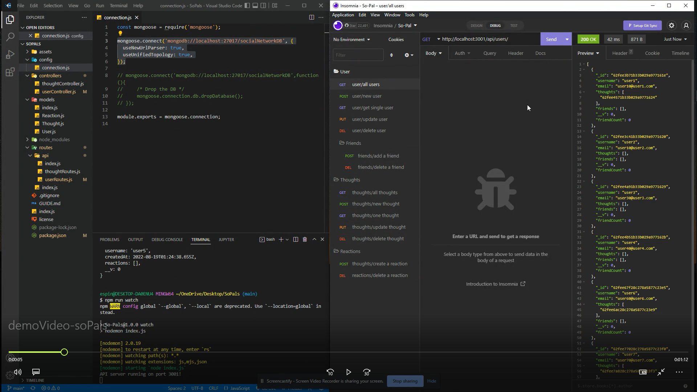

# So-Pals -deployed - https://sopalsreact.herokuapp.com/

[](https://opensource.org/licenses/MIT)
[](code_of_conduct.md)

## Description 
An API for a social network web application where users can share their thoughts, react to friends’ thoughts, and create a friend list. 

I used Express.js for routing, a MongoDB database, and the Mongoose ODM.  To demonstrate functionality I used [Insomnia](https://insomnia.rest/) for the demo video.

[GitHub repository](https://github.com/espinbrandon49/So-Pals)

## Demo
[](https://user-images.githubusercontent.com/102924713/185540904-65dd66db-eabb-4f99-8d2e-6b2b5d63ef49.mp4)

## Table of Contents 
  * [Installation](#installation)
  * [Usage](#usage)
  * [License](#license)
  * [Contributing](#contributing)
  * [Collaboration](#collaboration)
  * [Questions](#questions)
  
## Installation

Install node.js and NPM on windows, clone down the GitHub repository and install the npm packages.
1. Download and install [Node.js](https://nodejs.org/en/download/)
2. Clone the repository
```bash
git@github.com:espinbrandon49/So-Pals.git
```
3. Run npm install to install the npm dependencies from the [package.json](./package.json)
```bash
npm install
```

## Usage 
### Invoke the application to start the server
1. In the terminal enter this command
```
npm run start
```
or
```
npm run watch
```
### Insomnia can be used to open the API GET POST, PUT, and DELETE routes
2. [Insomnia.rest](https://docs.insomnia.rest/)

## License 
### MIT License 
The content of this application is licensed under the MIT License. 

[https://choosealicense.com/licenses/mit/](https://choosealicense.com/licenses/mit/) 

## Contributing 
[Contributor Covenant](https://www.contributor-covenant.org/)

## Collaboration
Jerome Chenette

## Questions 

Contact me by [E-mail](mailto:portfoliolinkemail@gmail.com) or [GitHub](https://github.com/espinbrandon49)